# EcoSense – Smart Waste Classification & Recycling Assistant

## 1. About the Project

EcoSense is a Python-based project made to help users classify common waste items and understand how they can be handled.

The user enters some basic information about a waste item, such as its name, material, condition, and quantity. Based on this information, EcoSense identifies the type of waste and gives a suitable recycling or disposal suggestion.

The entered record is also saved in a CSV file. This allows the user to view old records, search for a particular item, and see some basic statistics about the stored waste data.

I developed this project as a first-year B.Tech CSE project to apply the Python concepts learned in class to a practical problem.

---

## 2. Problem Statement

Waste is often not sorted correctly because people may not always know which category a particular item belongs to or how it should be handled.

For example, plastic, paper, glass, organic waste, and electronic waste need different methods of handling. Keeping track of waste records manually can also become difficult.

EcoSense provides a simple way to enter waste information, classify it, and get a basic recommendation for recycling or disposal. It also keeps a record of the entered information for later use.

---

## 3. Objectives

The main objectives of EcoSense are:

- To classify common types of waste.
- To give basic recycling or disposal suggestions.
- To check whether the information entered by the user is valid.
- To save waste records for future reference.
- To allow users to view previously saved records.
- To provide a simple search option.
- To calculate basic statistics from the stored data.
- To use the Python concepts learned during the course in a practical project.

---

## 4. Features of EcoSense

EcoSense currently provides the following features:

- Waste classification based on material.
- Input validation for important user inputs.
- Recycling and disposal recommendations.
- CSV-based storage of waste records.
- Waste history.
- Search by item name or material.
- Basic waste statistics.
- Error handling for incorrect input.
- Basic automated testing.

---

## 5. Waste Categories

EcoSense currently works with six main types of waste:

- Plastic
- Paper
- Glass
- Metal
- Organic
- E-Waste

Each material is mapped to its corresponding waste category by the classification module.

---

## 6. Main Modules

The program is divided into different Python files instead of putting all the code into one large file. This makes the project easier to understand and manage.

### 6.1 Classification

The classification part checks the material entered by the user and assigns the appropriate waste category.

For example, if the user enters `plastic`, the item is classified as `Plastic Waste`.

### 6.2 Input Validation

The validation part checks the information entered by the user.

It makes sure that the item name is not empty and that the quantity is a valid positive number. It also helps prevent incorrect input from causing the program to stop.

### 6.3 Recommendations

This part contains the recycling or disposal suggestions for the different types of waste.

For example, paper can be recycled when it is clean and dry, while electronic waste should be sent to an appropriate e-waste collection facility.

### 6.4 Waste History

The waste history feature stores the records in a CSV file and allows the user to view the information that has already been entered.

### 6.5 Search

The search feature allows the user to find stored records using an item name or material.

### 6.6 Statistics

The statistics feature reads the stored records and calculates simple values such as:

- Total number of records
- Total quantity
- Average quantity
- Minimum quantity
- Maximum quantity
- Number of different waste categories

---

## 7. Non-Functional Requirements

Apart from the main features, the project also has some basic non-functional requirements.

### Usability

The program should be simple enough for a user to understand and operate through the menu.

### Reliability

The program should handle incorrect inputs properly instead of stopping unexpectedly.

### Maintainability

The code is divided into separate modules so that individual parts can be modified without changing the entire program.

### Performance

The program should give results quickly when working with a normal number of waste records.

### Error Handling

The program should display understandable error messages when the user enters invalid information.

---

## 8. Project Structure

The project is arranged into different files and folders. Each file has a specific purpose.

```text
Ecosense/
├── .gitignore
├── main.py
├── classifier.py
├── validation.py
├── recommendation.py
├── models.py
├── history.py
├── statistics.py
├── utilities.py
├── requirements.txt
├── README.md
├── statement.md
│
├── data/
│   └── waste_records.csv
│
├── design/
│   ├── architecture_diagram.graphml
│   ├── workflow_diagram.graphml
│   ├── use_case_diagram.graphml
│   ├── class_diagram.graphml
│   ├── sequence_diagram.graphml
│   ├── component_diagram.graphml
│   └── storage_diagram.graphml
│
├── screenshots/
│   ├── 01_waste_history.png
│   ├── 01_waste_history_2.png
│   ├── 02_search.png
│   ├── 03_statistics.png
│   ├── 04_recommendations.png
│   ├── 05_error_handling.png
│   ├── 05_error_handling_quantity.png
│   ├── 05_error_handling_condition.png
│   ├── 05_error_handling_material.png
│   ├── 06_csv_storage.png
│   ├── 07_tests_passed.png
│   ├── architecture_diagram.png
│   ├── workflow_diagram.png
│   ├── use_case_diagram.png
│   ├── class_diagram.png
│   ├── sequence_diagram.png
│   ├── component_diagram.png
│   └── storage_diagram.png
│
└── tests/
    ├── __init__.py
    └── test_project.py
9. What Each Python File Does
main.py

This is the main file that the user runs. It displays the menu and connects the different parts of EcoSense.

classifier.py

This file contains the functions used to check the entered material and classify the waste.

validation.py

This file is responsible for checking user input such as the item name and quantity.

recommendation.py

This file contains the recycling and disposal recommendations for the supported waste materials.

models.py

This file contains the WasteItem class. It is used to keep all the information about one waste item together in the form of an object.

history.py

This file handles the waste records stored in the CSV file. It is used for saving records, displaying history, and searching records.

statistics.py

This file reads the stored records and uses NumPy to perform the basic statistical calculations.

utilities.py

This file contains some common functions used by the program, such as displaying headings, getting the waste condition, and determining the waste status.

10. Technologies Used

The project was developed using:

Python
Visual Studio Code
NumPy
CSV file handling
Object-Oriented Programming
Basic automated testing
11. Python Concepts Used

While developing EcoSense, I used several Python concepts that were covered in the course:

Variables and data types
Input and output
Conditional statements
Loops
Functions
Modules
Lists
Dictionaries
Sets
File handling
Exception handling
NumPy
Classes and objects
Constructors
Methods
Basic software testing

Using these concepts together helped me understand how separate Python topics can be combined to make a complete working project.

12. Data Storage

EcoSense uses a CSV file to store the waste records.

The file is located at:

data/waste_records.csv

Each record contains the following information:

Item name
Material
Condition
Quantity
Category
Status
Recommendation

For example:

item_name,material,condition,quantity,category,status,recommendation
Water bottle,plastic,clean,2,Plastic Waste,Recyclable,Recycle the plastic through an appropriate recycling system.

Using a CSV file makes the data easy to store and read without needing a separate database.

13. Installation
Step 1: Check Python

Make sure Python is installed on the computer.

Step 2: Open the Project

Open the Ecosense folder in Visual Studio Code.

Step 3: Install the Required Package

Open the terminal in VS Code and run:

python -m pip install -r requirements.txt

This installs the required package used by the project.

14. How to Run the Project

Open the VS Code terminal inside the main Ecosense folder.

Run:

python main.py

The main menu will appear:

=======================================================
       ECOSENSE - SMART WASTE CLASSIFICATION SYSTEM
=======================================================

1. Classify Waste
2. View Waste History
3. Search Waste Records
4. View Waste Statistics
5. View Recycling Recommendations
6. Exit

The user can enter the number of the option they want to use.

15. How EcoSense Works
15.1 Classify Waste

The user selects:

1. Classify Waste

The program then asks for:

Waste item name
Material
Condition
Quantity

The entered information is checked first. If everything is valid, the waste is classified, its status is determined, and a recycling or disposal recommendation is provided.

The complete record is then saved in the CSV file.

15.2 View Waste History

The user selects:

2. View Waste History

EcoSense reads the saved records from the CSV file and displays them.

15.3 Search Waste Records

The user selects:

3. Search Waste Records

The user can enter an item name or material. EcoSense searches the saved records and displays the matching entries.

15.4 View Waste Statistics

The user selects:

4. View Waste Statistics

The program reads the stored quantities and displays basic statistics such as the total quantity, average, minimum, maximum, and number of categories.

15.5 View Recycling Recommendations

The user selects:

5. View Recycling Recommendations

EcoSense displays the available recommendations for the supported materials.

15.6 Exit

The user selects:

6. Exit

The program ends and displays a thank-you message.

16. Input Validation and Error Handling

Input validation was added to make the program more reliable and user-friendly.

Invalid Material

If the user enters a material that is not supported, EcoSense shows an error message and displays the materials that can be selected.

Invalid Quantity

The quantity must be a positive whole number.

If the user enters text, zero, or a negative number, the program displays an appropriate message and asks for a valid quantity.

Invalid Condition

The program currently accepts three conditions:

clean
dirty
damaged

If the user enters anything else, an error message is displayed.

Empty Item Name

The item name cannot be left empty. If the user does not enter an item name, the program displays an error message.

17. Testing

Basic automated testing has been included to check some important parts of the project.

The test file is:

tests/test_project.py

To run the tests, open the terminal in the main Ecosense folder and run:

python -m tests.test_project

If all the tests work correctly, the output is:

All tests passed successfully!

The current tests check:

Waste classification
Material validation
Quantity validation
Recycling recommendations
18. Basic Project Workflow

The overall working of EcoSense can be represented as:

User
  ↓
Main Menu
  ↓
Enter Waste Information
  ↓
Validate Input
  ↓
Classify Waste
  ↓
Determine Status
  ↓
Give Recommendation
  ↓
Save Record
  ↓
View / Search / Calculate Statistics

The different tasks are handled by separate modules, which keeps the program organized and easier to understand.

19. System Design and Diagrams

The following diagrams are included to explain the structure and working of EcoSense.

19.1 Architecture Diagram

The architecture diagram gives an overall view of the main parts of EcoSense and how they communicate with each other.

19.2 Workflow Diagram

The workflow diagram shows the main steps followed by the program while processing a waste item.

19.3 Use Case Diagram

The use case diagram shows the main actions that a user can perform in EcoSense.

19.4 Class Diagram

The class diagram shows the WasteItem class, its attributes, and its method.

19.5 Sequence Diagram

The sequence diagram shows the order in which the user and different parts of the program interact while a waste item is being classified.

19.6 Component Diagram

The component diagram shows the main software components of EcoSense and their connections.

19.7 Data Storage Diagram

The data storage diagram shows how the waste records are stored in the CSV file and used by the program.

20. Screenshots

The screenshots below show some of the main features and testing performed during the development of EcoSense.

### Waste History

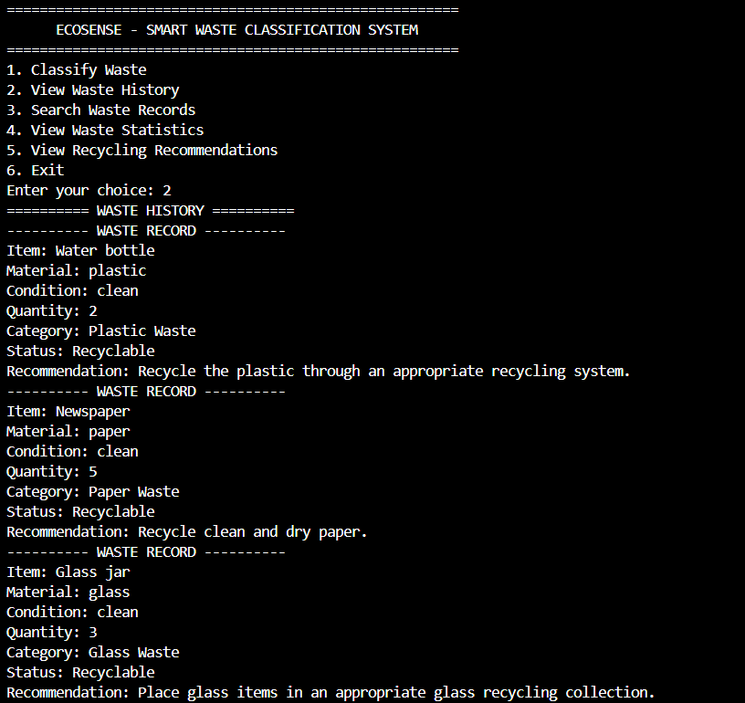

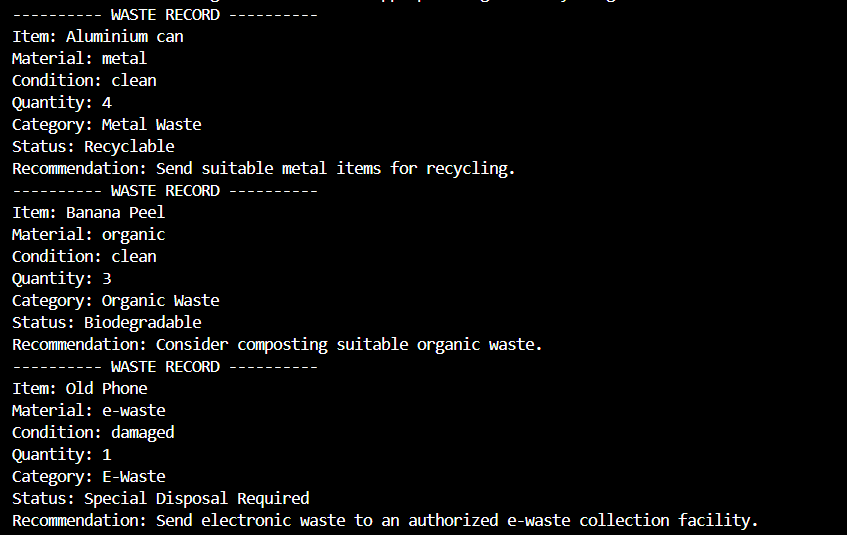

### Search

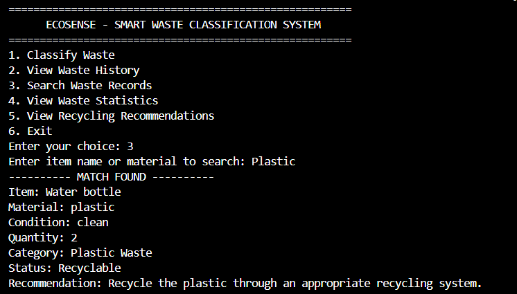

### Statistics

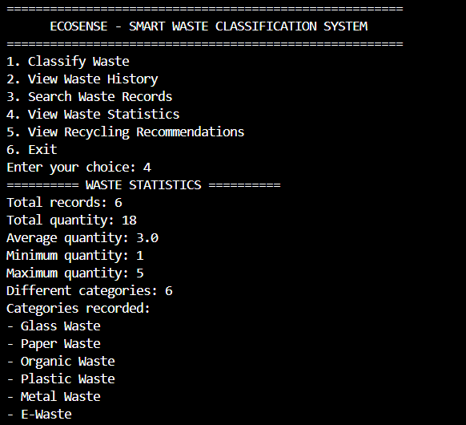

### Recommendations

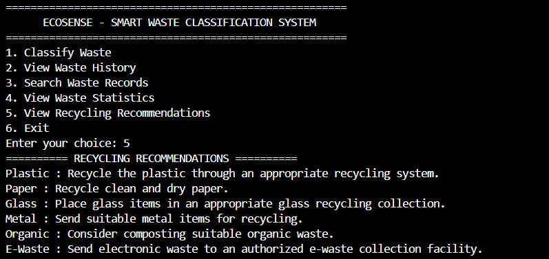

### Error Handling

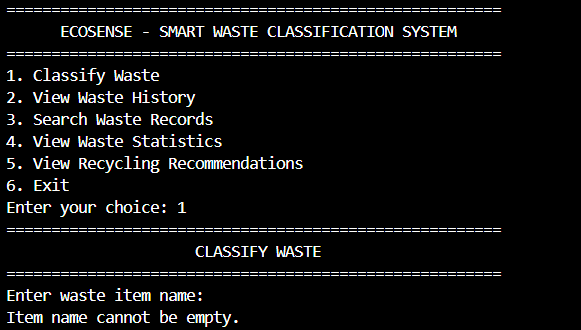

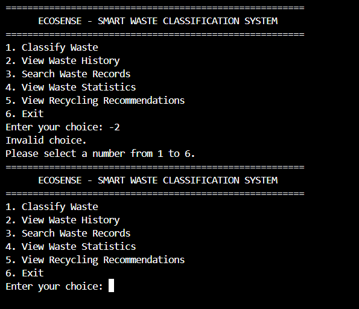

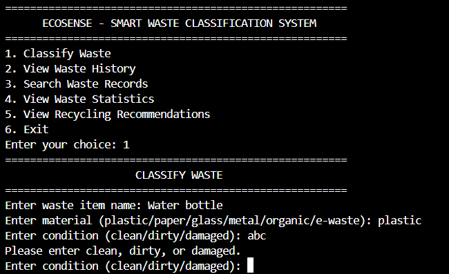

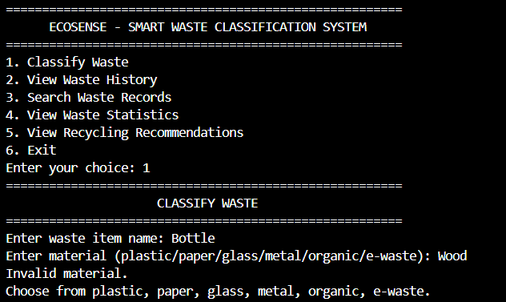

### CSV Storage

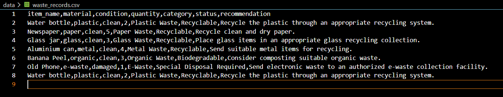

### Tests Passed

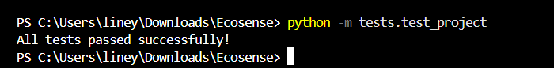

### Architecture Diagram

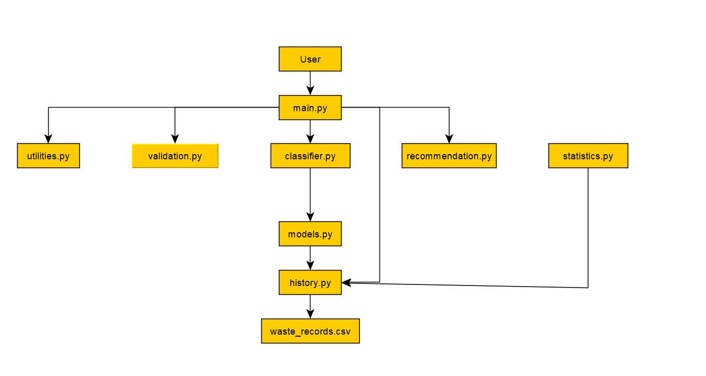

### Class Diagram

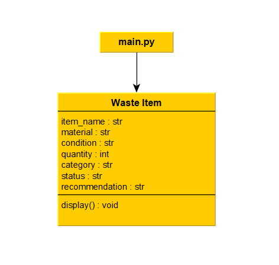

### Component Diagram

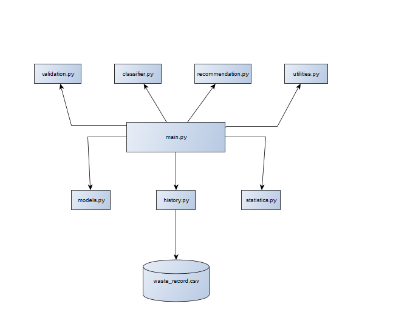

### Storage Diagram

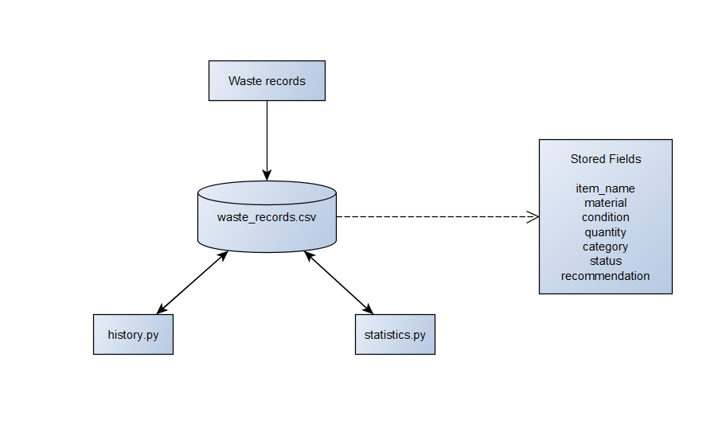

### Use Case Diagram

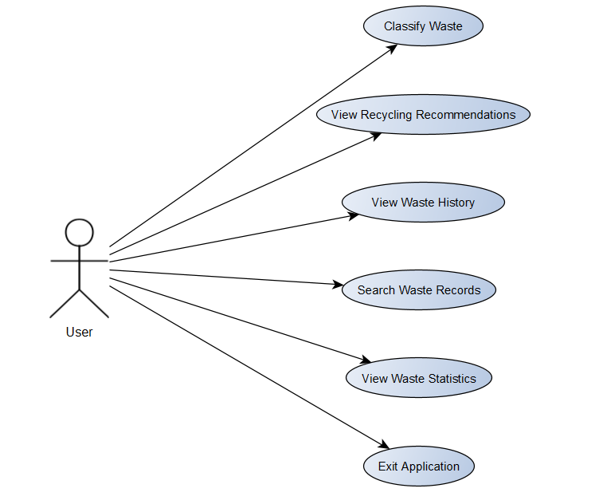

### Workflow Diagram

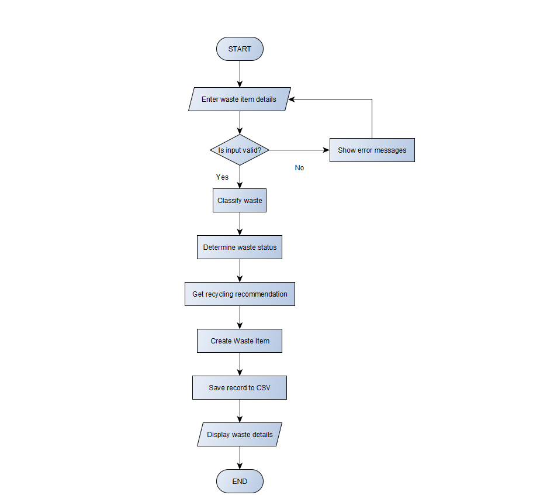

### Sequence Diagram

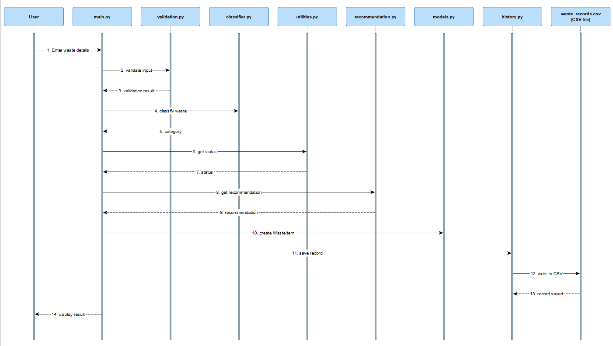

20.1 Waste History

20.2 Search Results

20.3 Waste Statistics

20.4 Recycling Recommendations

20.5 Error Handling

20.6 CSV Storage

20.7 Automated Testing

21. Future Improvements

The current version of EcoSense is a rule-based system. There are several ways in which it could be improved in the future.

Some possible improvements are:

Adding image-based waste recognition.
Using a camera to identify waste items.
Using machine learning for automatic classification.
Creating a graphical user interface.
Developing a mobile application.
Adding multilingual support.
Showing nearby recycling centres.
Adding charts and more detailed waste analysis.

These are future ideas and are not part of the current version of the project.

22. What I Learned From This Project

Working on EcoSense helped me understand how different Python concepts can be used together in one project.

Through this project, I learned:

How to divide a program into different modules.
How functions can be used to handle specific tasks.
How lists, dictionaries, and sets can be used to organize information.
How to read and write data using CSV files.
How to validate user input.
How to handle errors using exceptions.
How classes and objects can be used in Python.
How NumPy can be used for calculations.
How basic testing can be added to a project.
How to organize a complete project using files and folders.

I also got a better understanding of how a simple idea can be divided into smaller parts and then connected to create a working application.

23. Conclusion

EcoSense is a simple Python project that combines waste classification, recycling recommendations, data storage, searching, and basic statistics in one application.

The project helped me apply different concepts from the Python course, including functions, modules, data structures, file handling, exception handling, NumPy, Object-Oriented Programming, and testing.

The current version focuses on common waste materials and provides basic recommendations based on the information entered by the user. It also stores the records so that they can be viewed and searched later.

Although the current system is simple, it provides a good base for adding more advanced features such as image recognition, machine learning, and a graphical interface in the future.
